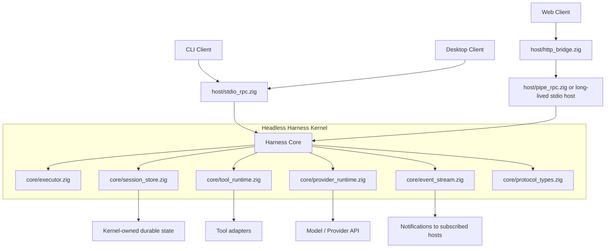
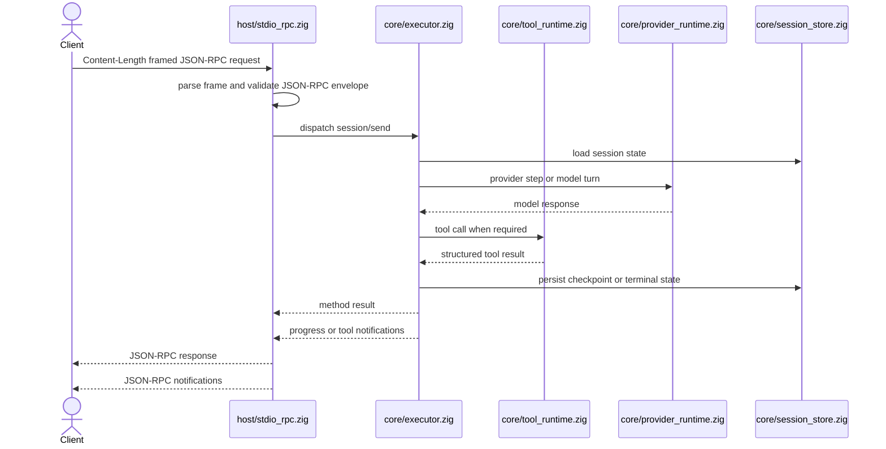
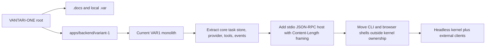

# VANTARI-ONE

**Local-first agent runtime architecture, a Zig-backed VAR1 session lane, and the migration path toward a headless JSON-RPC kernel.**

*Today this repo is an imported monorepo shell with one live backend lane. The root owns doctrine, research, and repo process. `apps/backend/variant-1` owns the current runtime slice.*

---

[](https://github.com/savageops/VANTARI-ONE/releases/latest)
[](https://github.com/savageops/VANTARI-ONE/releases)
[](https://github.com/savageops/VANTARI-ONE/stargazers)
[](https://ziglang.org/)
[](./LICENSE)

[Backend lane](./apps/backend/variant-1/README.md) | [Architecture blueprint](./.docs/research/agent-harness-architecture-blueprint.md) | [Mermaid diagrams](./.docs/research/agent-harness-architecture-mermaid.md) | [Root normalization](./.docs/research/2026-04-22-vantari-one-monorepo-root-normalization.md) | [Readiness review](./.docs/research/2026-04-23-public-readiness-review.md)

---

VANTARI-ONE is aimed at a local-first agent execution stack: canonical session persistence, thin operator clients, and a durable kernel boundary that can survive beyond a single embedded browser shell. The live implementation lane in this checkout is `VAR1`, a Zig backend slice under `apps/backend/variant-1/` plus a framework-free external browser client under `apps/frontend/var1-client/`. The broader architectural direction is a headless harness kernel that speaks `JSON-RPC 2.0` over `stdio` with `Content-Length` framing and treats CLI, desktop, and browser surfaces as clients instead of kernel identity.

This README is intentionally doing three jobs at once:

- showing the current repo truth
- exposing the target architecture with diagrams
- stating the public-release gate honestly instead of marketing around it

## Current state

- Git is attached at the root and points at `savageops/VANTARI-ONE`
- the only active app path is `apps/backend/variant-1`
- root architecture and research records live under `.docs/research/`
- tracked root doctrine and research live under `.docs/`, while generated local process state lives under `.var/` when scaffolded
- local secrets and Zig/runtime artifacts are now expected to stay local through `.gitignore`

## Repository topology

```text
VANTARI-ONE/
  apps/
    backend/
      variant-1/              // live Zig runtime lane
        src/                  // current app-owned source tree
        tests/                // contract verification
        scripts/              // operator wrappers
        .var/                 // app-local runtime truth
        .docs/                // app-local historical docs
  .docs/
    research/                 // root architecture and normalization docs
    todo/                     // append-only historical execution ledger
  .var/                       // generated local process state when the root is the workspace
    docs/                     // generated root process docs
    research/                 // generated root process research
    sessions/                 // generated root process session records
```

## What exists today

The live `VAR1` lane now exposes:

- a Zig CLI/runtime surface
- a bridge-only HTTP host
- a framework-free external browser client
- canonical session state under `.var/sessions/<id>/`
- relevance-gated root `.var` tools backed by the same session/runtime model
- a migration bridge from the current monolith toward a headless kernel

Read here first:

- [`apps/backend/variant-1/README.md`](./apps/backend/variant-1/README.md)
- [`apps/backend/variant-1/.docs/README.md`](./apps/backend/variant-1/.docs/README.md)
- [`.docs/research/agent-harness-architecture-blueprint.md`](./.docs/research/agent-harness-architecture-blueprint.md)
- [`.docs/research/agent-harness-architecture-mermaid.md`](./.docs/research/agent-harness-architecture-mermaid.md)

## Layered Module Map

Borrowing the strongest structural lesson from `pi-mono`, the Zig harness now exposes a canonical layered import view even though the implementation still lives in a mostly flat `src/` tree.

| Layer | Canonical namespace | Current owners | Responsibility |
|------|----------------------|----------------|----------------|
| `shared` | `VAR1.shared` | `src/shared/index.zig` -> `config.zig`, `fsutil.zig`, `types.zig` | Reusable contracts and filesystem/config helpers |
| `core` | `VAR1.core` | `src/core/index.zig` -> `loop.zig`, `store.zig`, `provider.zig`, `tools.zig`, `protocol_types.zig`, `agents.zig`, `harness_tools.zig` | Execution semantics, durable session state, provider IO, tool runtime, delegation |
| `host` | `VAR1.host` | `src/host/index.zig` -> `stdio_rpc.zig`, `web.zig` | Transport and bridge surfaces around the core |
| `clients` | `VAR1.clients` | `src/clients/index.zig` -> `cli.zig`, with the browser client living at `apps/frontend/var1-client` | Operator-facing shells that sit outside core ownership |

This is the current boundary doctrine for future extraction. The immediate goal is not package sprawl. The goal is one honest ownership map.

## Architecture direction

The target boundary is not "a bigger web app." The target boundary is a headless execution kernel with outer clients.

### Kernel boundary



### Request and event flow



### Current ownership and next split



## Why the repo is shaped this way

The root is the monorepo control plane. It owns:

- project framing
- architectural doctrine
- normalization research
- append-only execution logs

The backend lane owns runtime-adjacent materials today:

- app-local `.var` state
- operator scripts
- current tests
- bridge-facing browser client

That split is deliberate. It avoids pretending the root already owns a fully normalized multi-app product when the actual implementation pressure is still concentrated in one backend lane.

## Public release gate

The repo is materially closer to public shape than the earliest import snapshot. The tracked tree now includes the live Zig source owners, `build.zig`, and the active test suite under `apps/backend/variant-1/`.

Latest local Windows validation on 2026-04-28:

- `.\scripts\zigw.ps1 build test --summary all` -> `67/67 tests passed`
- `.\scripts\health.ps1` -> `status: ready`

The remaining release risk is no longer "missing source files." It is architectural and process drift:

- keep root docs, app docs, and runtime topology aligned to the same ownership map
- continue the internal `shared/core/host/clients` split before adding more product surfaces
- keep local secrets and runtime artifacts out of the tracked tree
- graduate from a one-lane imported monorepo into a cleaner release/process posture before broad public expansion

## Local configuration

Use [`apps/backend/variant-1/.env.example`](./apps/backend/variant-1/.env.example) for provider configuration shape. Do not publish a live `.env`.

## Source docs

- [`apps/backend/variant-1/README.md`](./apps/backend/variant-1/README.md)
- [`.docs/research/agent-harness-architecture-blueprint.md`](./.docs/research/agent-harness-architecture-blueprint.md)
- [`.docs/research/agent-harness-architecture-mermaid.md`](./.docs/research/agent-harness-architecture-mermaid.md)
- [`.docs/research/vantari-one-monorepo-structural-snapshot.md`](./.docs/research/vantari-one-monorepo-structural-snapshot.md)
- [`.docs/research/2026-04-23-public-readiness-review.md`](./.docs/research/2026-04-23-public-readiness-review.md)

## License

MIT. See [`LICENSE`](./LICENSE).
