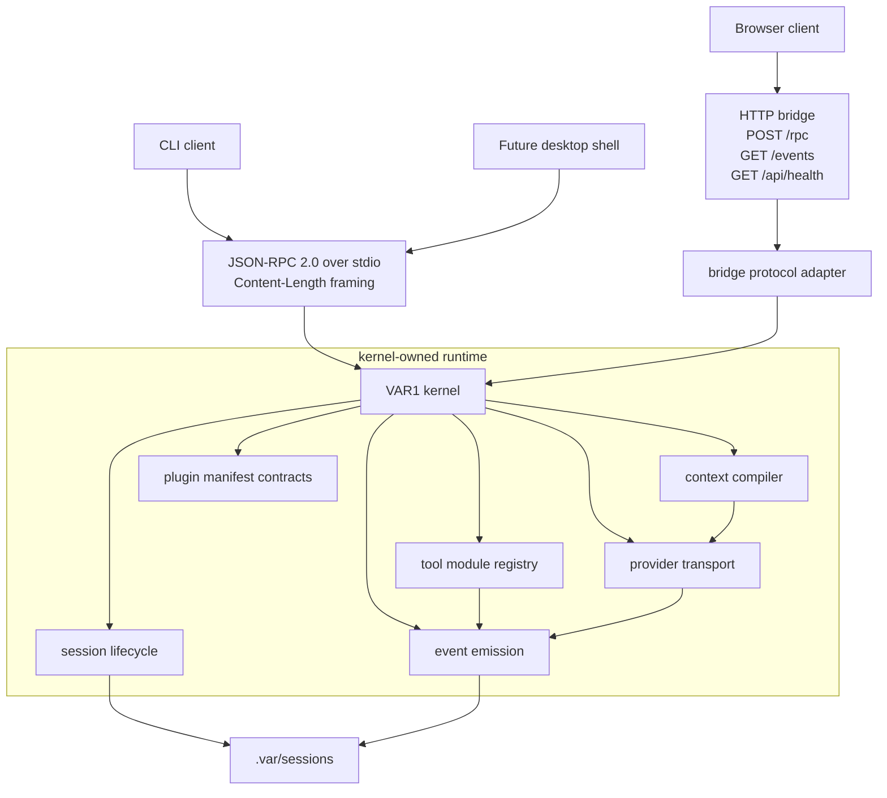
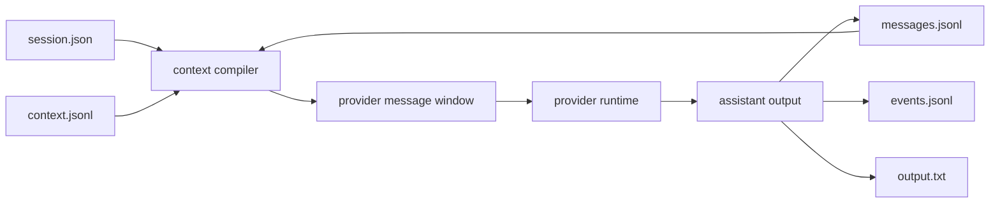
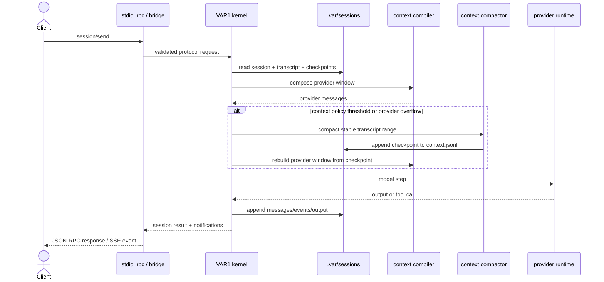

# VANTARI-ONE

<div align="center">

Ventari 1 is a local agent harness for running, extending, and supervising AI agent sessions from a fast Zig runtime.
`VAR1` is the kernel underneath it: CLI and browser clients drive sessions, tools, context, providers, events, and output through one coherent protocol.

[](https://github.com/savageops/VANTARI-ONE/releases/latest)
[](https://github.com/savageops/VANTARI-ONE/releases)
[](https://github.com/savageops/VANTARI-ONE/stargazers)
[](https://github.com/savageops/VANTARI-ONE/issues)
[](https://github.com/savageops/VANTARI-ONE/commits/main)
[](#architectural-overview)
[](https://ziglang.org/)
[](./LICENSE)

[Architecture](#architectural-overview) |
[Quick Start](#quick-start) |
[Capabilities](#capabilities) |
[Session State](#session-state) |
[Protocol](#protocol-contract) |
[Configuration](#configuration) |
[Validation](#validation)

</div>

---

## Why Ventari

Ventari is built for people who want to operate agents, not babysit scattered scripts. It gives each agent run a session, a tool surface, provider configuration, context management, event history, and CLI/browser control through one Zig-powered harness.

## At a Glance

| Surface | Contract |
|---|---|
| Harness kernel | `VAR1`, a Zig executable with one hidden `kernel-stdio` host mode |
| Agent sessions | `.var/sessions/<id>/` with transcript, context checkpoints, events, and output |
| Protocol | JSON-RPC 2.0 over stdio, plus an HTTP bridge for browser clients |
| Context | Builder-owned model windows from immutable messages plus compact checkpoints |
| Tools | Per-tool module registry with availability metadata and explicit external command boundaries |
| Clients | CLI and framework-free browser shell; neither owns runtime state |

## Quick Start

Build the kernel, verify readiness, then run one prompt from the backend lane:

```powershell
cd apps/backend/variant-1
.\scripts\zigw.ps1 build test --summary all
.\scripts\health.ps1
.\zig-out\bin\VAR1.exe run --prompt "Return exactly 3."
```

Open the browser client after the bridge is running:

```powershell
.\zig-out\bin\VAR1.exe serve --host 127.0.0.1 --port 4310
```

Then open [`apps/frontend/var1-client/index.html`](./apps/frontend/var1-client/index.html) and point it at `http://127.0.0.1:4310`.

## Architectural Overview



`VAR1` runs the agent work. CLI and browser surfaces send protocol requests into the same harness runtime. Session state, transcript assembly, provider interaction, tool dispatch, and event emission stay inside the Zig kernel.

## Capabilities

| Capability | Contract |
|---|---|
| Session-native execution | Creates, resumes, sends, compacts, cancels, reads, and lists sessions through the protocol surface. |
| Session history | Persists user/assistant messages in `messages.jsonl` with stable message identifiers and monotonic sequence numbers. |
| Context compilation | Builds provider-ready message windows from `session.json`, `messages.jsonl`, and the latest `context.jsonl` checkpoint. |
| Checkpointed compaction path | Generates deterministic Zig-native summary checkpoints in `context.jsonl` without replacing the complete transcript. |
| Event persistence | Records runtime progress, tool lifecycle entries, bridge notifications, and terminal state in `events.jsonl`. |
| Tool integration | Publishes built-in tool contracts and availability metadata from the kernel registry as JSON schemas for provider calls, `tools/list`, and `VAR1 tools --json`. |
| Command-backed search | Exposes `search_files` as the content-search tool over the external `iex` executable; availability is false until a real executable is resolvable. |
| Plugin boundary | Validates plugin manifests and socket declarations without runtime loading or direct store/provider access. |
| Provider isolation | Resolves OpenAI-compatible provider configuration behind the runtime boundary. |
| Browser ingress | Exposes `/rpc`, `/events`, and `/api/health` through a local-origin bridge with token-gated RPC/event access. |
| CLI ingress | Uses the same session/protocol vocabulary rather than maintaining a separate execution path. |

## Tool Runtime

Tool contracts are kernel-owned. Per-tool file and agent modules live under `apps/backend/variant-1/src/core/tools/builtin/`; each built-in tool exports its `definition`, `availability`, and `execute` contract. `src/core/tools/runtime.zig` composes those modules for dispatch and catalog output, `src/core/tools/registry.zig` resolves capability availability from module-owned tool names/specs, and `src/core/tools/module.zig` owns shared runner/context/envelope types. Provider schema serialization still flows through `src/core/providers/openai_compatible.zig`.

`tools/list` and `VAR1 tools --json` expose the same catalog, including availability metadata. `search_files` is the only content-search tool. It shells to `iex search --json` through the command-runner boundary and declares an `external_command("iex")` dependency. A checkout or packaged install must provide a real `iex` executable on `PATH` or beside the process before that tool is available; missing search dependencies are reported as unavailable capabilities instead of late process-spawn surprises. `list_files` is a native Zig directory/file discovery primitive and does not depend on `iex`.

Plugin support is currently contract-level: `src/core/tools/sockets.zig` validates typed tool sockets and `src/core/plugins/manifest.zig` validates plugin socket declarations. There is no automatic plugin discovery or dynamic plugin execution in the shipped runtime.

## Bridge Security

`VAR1 serve` binds to `127.0.0.1` by default. Browser startup reads `/api/health`, receives a per-process `bridge_token`, and sends it as `X-VAR1-Bridge-Token` for `/rpc` and `/events`. CORS is restricted to explicit local HTTP origins (`127.0.0.1`, `localhost`, and IPv6 loopback); `file://` / `Origin: null` callers are rejected so browser access stays provenance-bound. `src/host/bridge_access.zig` owns local-origin, token, redaction, and audit classification policy so route handling stays transport-focused. Bridge-visible health and error payloads redact sensitive fields before they leave the backend.

## Session State

```text
.var/sessions/<session-id>/
  session.json
  messages.jsonl
  context.jsonl
  events.jsonl
  output.txt
```

| Artifact | Semantics |
|---|---|
| `session.json` | lifecycle state, prompt metadata, provider/runtime fields, parent/continuation references |
| `messages.jsonl` | complete durable transcript |
| `context.jsonl` | compacted/model-ready checkpoint history |
| `events.jsonl` | progress, tool, bridge, and runtime events |
| `output.txt` | latest terminal assistant output |



`messages.jsonl` and `context.jsonl` are separate control planes. The transcript remains the complete session history; context checkpoints constrain the provider-visible working set.

## Protocol Contract

The kernel exposes JSON-RPC 2.0 methods over stdio. Frames use `Content-Length` headers.

| Method | Runtime operation |
|---|---|
| `initialize` | returns server version and capability flags |
| `health/get` | returns readiness, provider, workspace, and auth-plan metadata |
| `session/create` | initializes a session record |
| `session/resume` | loads an existing session into runtime state |
| `session/send` | appends optional user input, compiles context, auto-compacts when policy requires it, and advances execution |
| `session/compact` | writes an entry-aware manual context checkpoint from stable message sequence ranges |
| `session/cancel` | marks cancellation intent for a running session |
| `session/get` | returns session summary, messages, and events |
| `session/list` | returns known session summaries |
| `tools/list` | returns the tool surface in text or JSON format |
| `events/subscribe` | enables `session/event` notifications |



`session/compact` accepts optional `keep_recent_messages`, `max_entries_per_checkpoint`, `aggressiveness`, and `trigger` fields. `max_entries_per_checkpoint` lets the same primitive compact one JSONL row or a bounded segment at a time. `aggressiveness` is a `0..1` slider projected into the checkpoint as `aggressiveness_milli`; a stronger later value can recompact the previously covered range from the immutable transcript instead of stacking duplicate work.

The executor uses the same compactor for automatic pressure relief. It estimates the provider window before each model call, compares it with the local context policy, writes `context_compaction_started` / `context_compaction_completed` / `context_compaction_skipped` events, rebuilds provider messages through the context builder, and retries once when an OpenAI-compatible provider reports an explicit context-window overflow. `messages.jsonl` remains the complete transcript; only the model-visible window changes.

## Configuration

Runtime configuration is resolved from the backend lane at `apps/backend/variant-1`. Provider credentials stay in `.env` or the auth ledger; non-secret context policy can be overridden in `.var/config/settings.toml`.

| Parameter | Required | Meaning |
|---|---|---|
| `BASE_URL` | yes | OpenAI-compatible provider base URL |
| `API_KEY` | yes | provider credential or local provider placeholder |
| `MODEL` | yes | model identifier sent to the provider |
| `WORKSPACE` | no | workspace root for `.var/` resolution; defaults to `.` |
| `MAX_STEPS` | no | execution step ceiling; defaults to `1` when resolved from auth-only config |

Reference shape: [`apps/backend/variant-1/.env.example`](./apps/backend/variant-1/.env.example).

Context policy TOML shape:

```toml
[context]
auto_compaction = true
manual_compaction = true
context_window_tokens = 128000
compact_at_ratio = 0.85
reserve_output_tokens = 8192
keep_recent_messages = 8
max_entries_per_checkpoint = 0
aggressiveness_milli = 350
retry_on_provider_overflow = true
```

Essential local commands:

```powershell
cd apps/backend/variant-1
.\scripts\zigw.ps1 build test --summary all
.\scripts\health.ps1
.\zig-out\bin\VAR1.exe run --prompt "Return exactly 3."
```

## Validation

Latest local Windows validation recorded on 2026-04-29:

```text
.\scripts\zigw.ps1 build test --summary all  -> 80/80 tests passed
.\zig-out\bin\VAR1.exe tools --json          -> search_files reports external_command iex availability
```

Provider-backed smoke validation depends on the configured provider exposing `MODEL` through its authenticated model list.

## Read Next

- [`apps/backend/variant-1/README.md`](./apps/backend/variant-1/README.md)
- [`apps/backend/variant-1/architecture.md`](./apps/backend/variant-1/architecture.md)
- [`apps/frontend/var1-client/README.md`](./apps/frontend/var1-client/README.md)

## License

MIT. See [`LICENSE`](./LICENSE).
