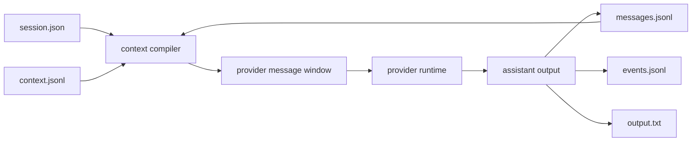
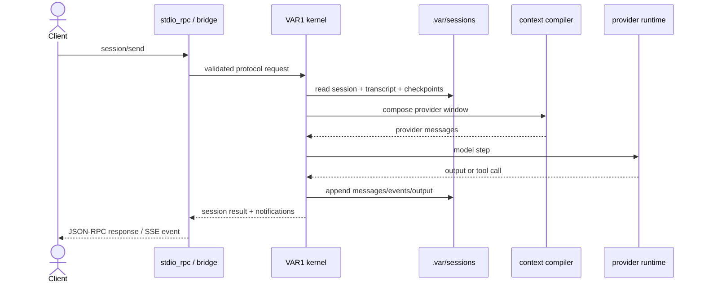

# VANTARI-ONE

<div align="center">

Ventari 1 provides a project-local agent runtime that executes model sessions through the `VAR1` Zig kernel, persists replayable `.var/sessions` ledgers, and exposes CLI/browser ingress through JSON-RPC and HTTP bridge contracts.

[](https://github.com/savageops/VANTARI-ONE/releases/latest)
[](https://github.com/savageops/VANTARI-ONE/releases)
[](https://github.com/savageops/VANTARI-ONE/stargazers)
[](https://github.com/savageops/VANTARI-ONE/issues)
[](https://github.com/savageops/VANTARI-ONE/commits/main)
[](#architectural-overview)
[](https://ziglang.org/)
[](./LICENSE)

[Architecture](#architectural-overview) |
[Capabilities](#capabilities) |
[Session Ledger](#session-ledger) |
[Protocol](#protocol-contract) |
[Configuration](#configuration) |
[Validation](#validation)


</div>

---

## Architectural Overview


`VAR1` is the execution boundary. CLI and browser surfaces are clients. Session state, transcript assembly, provider interaction, tool dispatch, and event emission remain kernel-owned.

## Capabilities

| Capability | Contract |
|---|---|
| Session-native execution | Creates, resumes, sends, compacts, cancels, reads, and lists sessions through the protocol surface. |
| Durable transcript ledger | Persists user/assistant messages in `messages.jsonl` with stable message identifiers and monotonic sequence numbers. |
| Context compilation | Builds provider-ready message windows from `session.json`, `messages.jsonl`, and the latest `context.jsonl` checkpoint. |
| Checkpointed compaction path | Generates deterministic Zig-native summary checkpoints in `context.jsonl` without replacing the complete transcript. |
| Event persistence | Records runtime progress, tool lifecycle entries, bridge notifications, and terminal state in `events.jsonl`. |
| Tool integration | Publishes built-in tool contracts from the kernel registry as JSON schemas for provider calls and `tools/list`. |
| Command-backed search | Exposes `search_files` as the content-search tool over the external `iex` executable; `list_files` remains native Zig workspace discovery. |
| Plugin boundary | Validates plugin manifests and socket declarations without runtime loading or direct store/provider access. |
| Provider isolation | Resolves OpenAI-compatible provider configuration behind the runtime boundary. |
| Browser ingress | Exposes `/rpc`, `/events`, and `/api/health` as bridge surfaces over the kernel protocol. |
| CLI ingress | Uses the same session/protocol vocabulary rather than maintaining a separate execution path. |

## Tool Runtime

Tool contracts are kernel-owned. The live registry starts in `src/core/tools/runtime.zig`, flows through `builtinDefinitionsForContext(...)`, and is serialized into provider-compatible function schemas by `src/core/providers/openai_compatible.zig`. The same definitions are exposed over `tools/list` and `VAR1 tools --json`.

`search_files` is the only content-search tool. It shells to `iex search --json` through the command-runner boundary. A checkout or packaged install must provide a real `iex` executable on `PATH` or beside the process before that tool is operational. `list_files` is a native Zig directory/file discovery primitive and does not depend on `iex`.

Plugin support is currently contract-level: `src/core/tools/sockets.zig` validates typed tool sockets and `src/core/plugins/manifest.zig` validates plugin socket declarations. There is no automatic plugin discovery or dynamic plugin execution in the shipped runtime.

## Session Ledger

```text
.var/sessions/<session-id>/
  session.json
  messages.jsonl
  context.jsonl
  events.jsonl
  output.txt
```

| Artifact | Semantics |
|---|---|
| `session.json` | lifecycle state, prompt metadata, provider/runtime fields, parent/continuation references |
| `messages.jsonl` | complete durable transcript |
| `context.jsonl` | compacted/model-ready checkpoint ledger |
| `events.jsonl` | progress, tool, bridge, and runtime events |
| `output.txt` | latest terminal assistant output |



`messages.jsonl` and `context.jsonl` are separate control planes. The transcript remains the audit ledger; context checkpoints constrain the provider-visible working set.

## Protocol Contract

The kernel exposes JSON-RPC 2.0 methods over stdio. Frames use `Content-Length` headers.

| Method | Runtime operation |
|---|---|
| `initialize` | returns server version and capability flags |
| `health/get` | returns readiness, provider, workspace, and auth-plan metadata |
| `session/create` | initializes a session record |
| `session/resume` | loads an existing session into runtime state |
| `session/send` | appends optional user input and advances execution |
| `session/compact` | writes an entry-aware context checkpoint from stable message sequence ranges |
| `session/cancel` | marks cancellation intent for a running session |
| `session/get` | returns session summary, messages, and events |
| `session/list` | returns known session summaries |
| `tools/list` | returns the tool surface in text or JSON format |
| `events/subscribe` | enables `session/event` notifications |



`session/compact` accepts optional `keep_recent_messages`, `max_entries_per_checkpoint`, `aggressiveness`, and `trigger` fields. `max_entries_per_checkpoint` lets the same primitive compact one JSONL row or a bounded segment at a time. `aggressiveness` is a `0..1` slider projected into the checkpoint as `aggressiveness_milli`; a stronger later value can recompact the previously covered range from the immutable transcript instead of stacking duplicate work.

## Configuration

Runtime configuration is resolved from the backend lane at `apps/backend/variant-1`.

| Parameter | Required | Meaning |
|---|---|---|
| `BASE_URL` | yes | OpenAI-compatible provider base URL |
| `API_KEY` | yes | provider credential or local provider placeholder |
| `MODEL` | yes | model identifier sent to the provider |
| `WORKSPACE` | no | workspace root for `.var/` resolution; defaults to `.` |
| `MAX_STEPS` | no | execution step ceiling; defaults to `1` when resolved from auth-only config |

Reference shape: [`apps/backend/variant-1/.env.example`](./apps/backend/variant-1/.env.example).

Essential local commands:

```powershell
cd apps/backend/variant-1
.\scripts\zigw.ps1 build test --summary all
.\scripts\health.ps1
.\zig-out\bin\VAR1.exe run --prompt "Return exactly 3."
```

## Validation

Latest local Windows validation recorded on 2026-04-28:

```text
.\scripts\zigw.ps1 build test --summary all  -> 67/67 tests passed
.\scripts\health.ps1                         -> status: ready
```

Provider-backed smoke validation depends on the configured provider exposing `MODEL` through its authenticated model list.

## Read Next

- [`apps/backend/variant-1/README.md`](./apps/backend/variant-1/README.md)
- [`apps/backend/variant-1/architecture.md`](./apps/backend/variant-1/architecture.md)
- [`.docs/research/2026-04-24-context-builder-baseline.md`](./.docs/research/2026-04-24-context-builder-baseline.md)
- [`.docs/research/2026-04-24-pluggable-backend-hierarchy-baseline.md`](./.docs/research/2026-04-24-pluggable-backend-hierarchy-baseline.md)

## License

MIT. See [`LICENSE`](./LICENSE).
