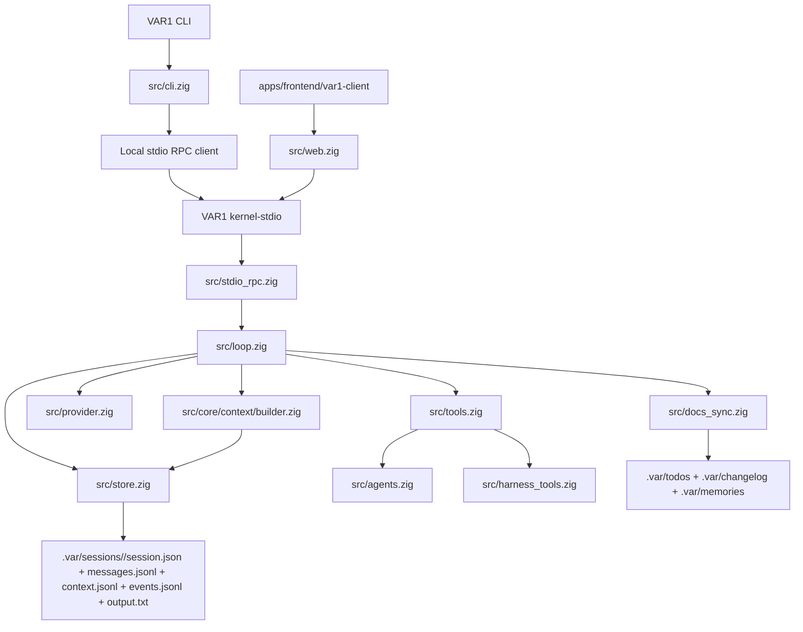
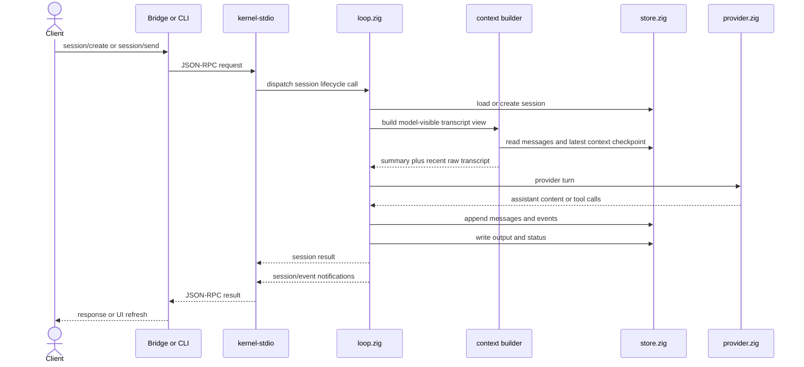
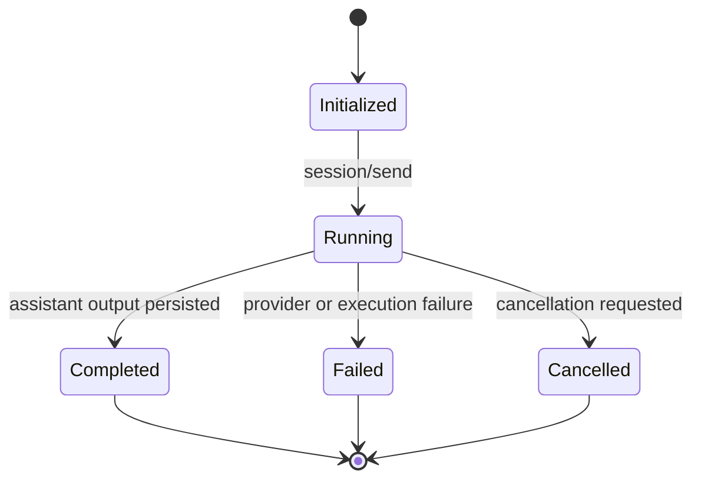

# VAR1 Architecture

This is the canonical architecture map for the current `VAR1` runtime.

## Architecture lock

- one execution primitive: session
- one durable source of truth: `.var/sessions/<id>/`
- one canonical host protocol: JSON-RPC 2.0 over stdio with Content-Length framing
- one bridge surface for browser clients: `/rpc`, `/events`, `/api/health`
- one executable name: `VAR1`
- one hidden host mode: `kernel-stdio`
- one external browser client: `apps/frontend/var1-client`
- temporary `/api/tasks*` compatibility exists only at the HTTP bridge edge

## Runtime slice

## Session message flow

## Session state machine

## Durable contract

Every session directory contains:

- `session.json`
- `messages.jsonl`
- `context.jsonl`
- `events.jsonl`
- `output.txt`

`messages.jsonl` is the complete append-only transcript. `context.jsonl` is a compact checkpoint ledger used by the context builder to create model-visible history without rewriting transcript history.

`store.ensureStoreReady(...)` upgrades legacy layouts before normal execution:

- `.harness/tasks/<id>/task.json` -> `.var/sessions/<id>/session.json`
- `turns.jsonl` -> `messages.jsonl`
- `journal.jsonl` -> `events.jsonl`
- `answer.txt` -> `output.txt`

Legacy ids such as `task-...` remain valid as opaque session ids.

## Module ownership

- `src/types.zig`
  shared runtime types and session contracts
- `src/store.zig`
  canonical session storage plus one-time migration
- `src/loop.zig`
  kernel-owned execution loop
- `src/core/context/builder.zig`
  sole owner for turning session storage into provider-ready transcript messages
- `src/core/tools/`
  typed tool socket namespace and validation facade around the current tool runtime
- `src/core/plugins/`
  plugin manifest/socket contracts only; plugin implementations do not live in core
- `src/protocol_types.zig`
  JSON-RPC methods and payload shapes
- `src/stdio_rpc.zig`
  Content-Length framed stdio host and local child-process client
- `src/web.zig`
  HTTP bridge plus temporary task-facade translation
- `src/cli.zig`
  thin protocol-backed CLI
- `apps/frontend/var1-client`
  external static browser client over `/rpc` and `/events`

## Compatibility boundary

The bridge still exposes `/api/tasks*` for one wave, but only as translation:

- `task` in compatibility responses maps to `session`
- `answer` maps to `output`
- `turns` maps to `messages`
- `journal` maps to `events`

No task-native execution logic remains in the kernel.

## Pluggability boundary

`core/` contains kernel capability domains, not plugin names. The current socket hierarchy is intentionally small:

- `core/context/` owns model-visible transcript assembly.
- `core/tools/` owns tool socket contracts and delegates to the current runtime body.
- `core/plugins/` owns manifest validation for future plugin roots.

Future plugin implementations should live outside `core/` and register through typed sockets. Auto-discovery is not enabled until manifest validation, explicit enablement, deterministic load order, and lifecycle tests are in place.

## Validation lane

The current validation lane should always prove these slices together:

- `build test`
- `health`
- direct `run`
- delegated child-session `run`
- bridge root response is text, not embedded HTML
- bridge task-facade routes still work
- external client exists at `apps/frontend/var1-client`

Latest local Windows validation on 2026-04-28:

- `.\scripts\zigw.ps1 build test --summary all` -> `67/67 tests passed`
- `.\scripts\health.ps1` -> `status: ready`
