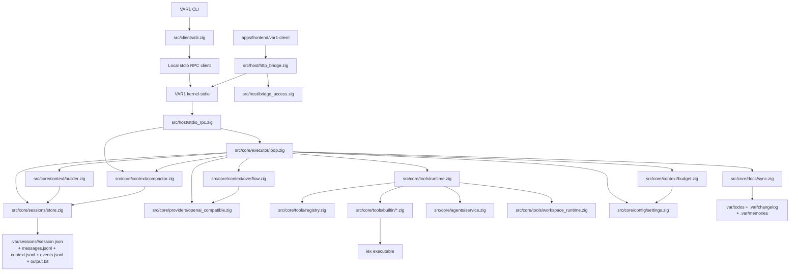
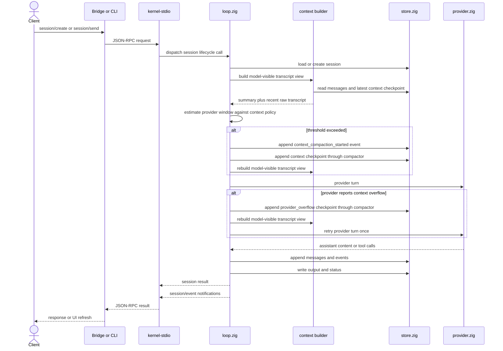
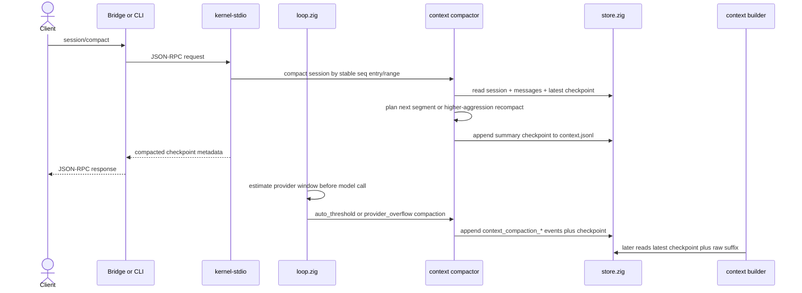
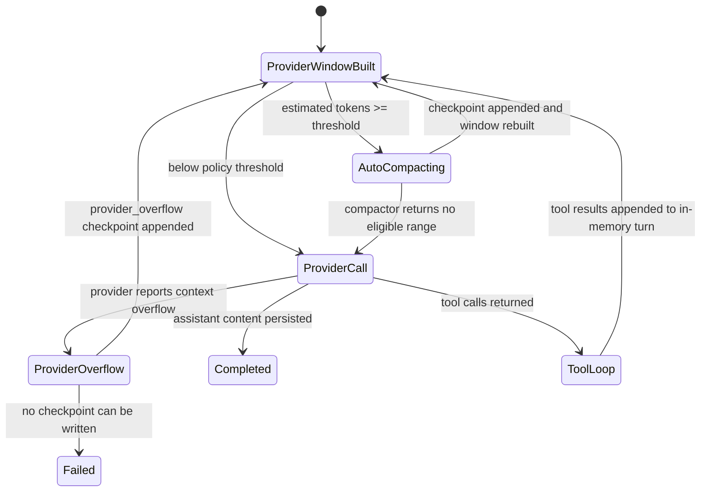
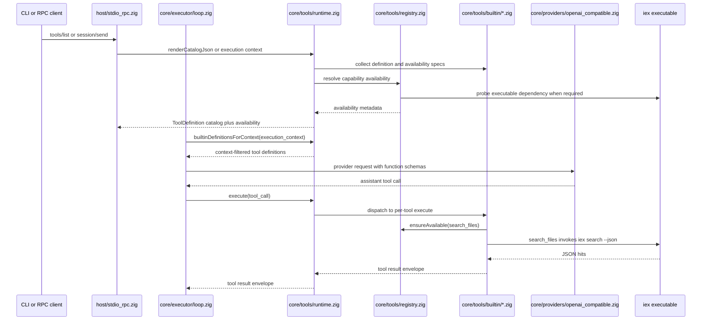
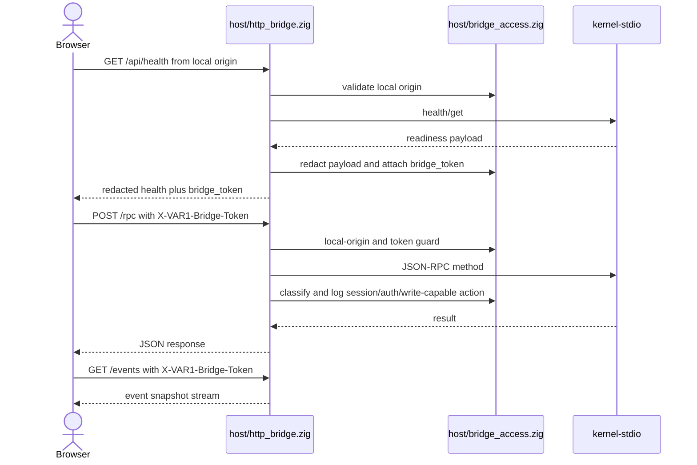
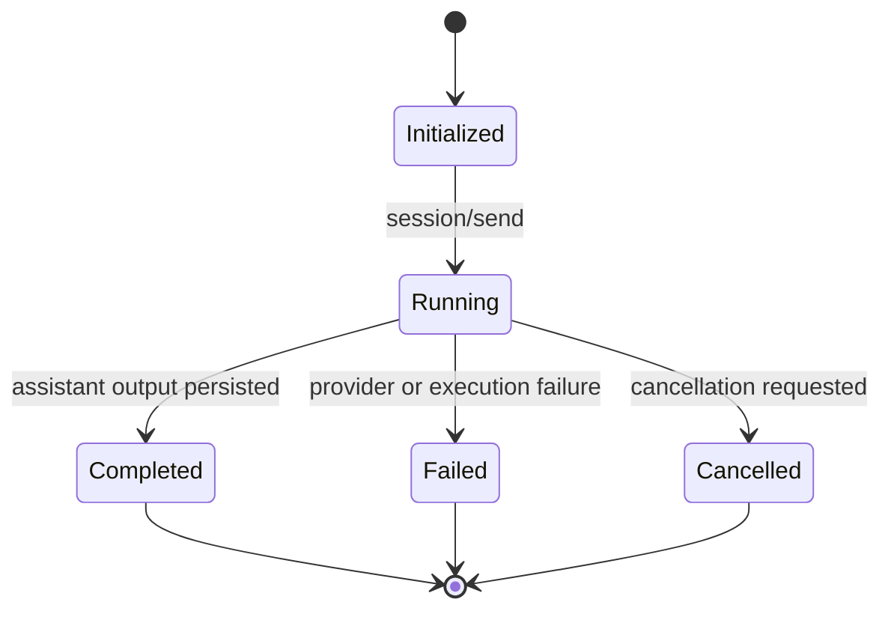

# VAR1 Architecture

This is the canonical architecture map for the current `VAR1` agent harness runtime.

## Architecture lock

- one execution primitive: session
- one durable source of truth: `.var/sessions/<id>/`
- one canonical host protocol: JSON-RPC 2.0 over stdio with Content-Length framing
- one local bridge surface for browser clients: `/rpc`, `/events`, `/api/health` with token-gated RPC/event access
- one executable name: `VAR1`
- one hidden host mode: `kernel-stdio`
- one external browser client: `apps/frontend/var1-client`

## Runtime slice

## Session message flow

## Context compaction flow

Manual and automatic compaction share the same primitive. The manual RPC path is gated by `context.manual_compaction`; the executor path is gated by `context.auto_compaction`, `context.context_window_tokens`, `context.compact_at_ratio`, and `context.reserve_output_tokens`. Provider overflow recovery is separately gated by `context.retry_on_provider_overflow` and retries one provider call after a real checkpoint is written.

## Tool initialization flow

Tool definitions are schema-first. The shared shape lives in `shared/types.zig` as `ToolDefinition { name, description, parameters_json, example_json, usage_hint }`. Per-tool modules under `core/tools/builtin/` own their definition, availability contract, and execute path. The registry resolves availability from module-owned names/specs instead of duplicating string branches. Provider request construction, CLI catalog export, RPC catalog export, and failure repair hints derive from those module-owned metadata surfaces.

`search_files` is the content-search tool. It declares an `external_command("iex")` dependency, resolves the workspace path in Zig, then invokes `iex search --json --max-hits ...` through the command-runner boundary. `list_files` is the native Zig path-discovery tool and does not shell to `iex`. Installing `VAR1` therefore requires a real `iex` executable for content search; when it is absent, catalog availability reports `search_files` as unavailable and execution fails early with `ToolUnavailable`.

## Bridge access flow

The bridge binds to `127.0.0.1` by default. CORS allows only explicit local HTTP origins; direct-file `Origin: null` callers are rejected so bridge access remains bound to a local browser origin. `/rpc` and `/events` require the health-issued bridge token; `/api/health` is the handshake route. `host/bridge_access.zig` owns access policy, sensitive-field redaction, and audit classification; `host/http_bridge.zig` owns the route transport.

## Session state machine

## Durable contract

Every session directory contains:

- `session.json`
- `messages.jsonl`
- `context.jsonl`
- `events.jsonl`
- `output.txt`

`messages.jsonl` is the complete append-only transcript. `context.jsonl` is compact checkpoint history written by the context compactor and used by the context builder to create model-visible history without rewriting transcript history. Each checkpoint marks the covered source sequence range, the next raw `first_kept_seq`, `compacted_entry_count`, and `aggressiveness_milli`, so compaction can advance one JSONL entry at a time or recompact an existing range when a stronger slider value is requested.

`.var/config/settings.toml` is the optional non-secret policy file. The `[context]` table owns `auto_compaction`, `manual_compaction`, `context_window_tokens`, `compact_at_ratio`, `reserve_output_tokens`, `keep_recent_messages`, `max_entries_per_checkpoint`, `aggressiveness_milli`, and `retry_on_provider_overflow`. Provider URL, model, API keys, and auth-plan state do not move into this file.

`store.ensureStoreReady(...)` validates and rewrites existing `.var/sessions/<id>/session.json` records into the current canonical shape. It does not read old roots, old-layout files, or old-layout fields.

## Module ownership

- `src/shared/types.zig`
  shared runtime types and session contracts
- `src/core/sessions/store.zig`
  canonical session storage
- `src/core/executor/loop.zig`
  kernel-owned execution loop
- `src/core/context/builder.zig`
  sole owner for turning session storage into provider-ready transcript messages
- `src/core/context/compactor.zig`
  sole owner for planning and writing summary checkpoints from stable message sequence entries/ranges
- `src/core/context/budget.zig`
  approximate provider-window token estimator and compaction-threshold calculator
- `src/core/context/overflow.zig`
  provider-error classifier for explicit context-window overflow, excluding rate-limit and availability failures
- `src/core/config/settings.zig`
  optional `.var/config/settings.toml` policy loader for non-secret runtime controls
- `src/core/tools/`
  typed tool socket namespace, built-in module registry/runtime, availability resolver, command-backed search dispatch, and workspace-state helpers
- `src/core/plugins/`
  plugin manifest/socket contracts only; plugin implementations do not live in core
- `src/shared/protocol/types.zig`
  JSON-RPC methods and payload shapes
- `src/host/stdio_rpc.zig`
  Content-Length framed stdio host and local child-process client
- `src/host/bridge_access.zig`
  local HTTP bridge access policy for origin checks, token validation, redaction, and audit classification
- `src/host/http_bridge.zig`
  local HTTP bridge route transport for `/rpc`, `/events`, and `/api/health`
- `src/clients/cli.zig`
  thin protocol-backed CLI
- `apps/frontend/var1-client`
  external static browser client over `/api/health`, `/rpc`, and `/events`

## Pluggability boundary

`core/` contains kernel capability domains, not plugin names. The current socket hierarchy is intentionally small:

- `core/context/` owns model-visible transcript assembly, checkpoint generation, budget estimation, and provider-overflow classification.
- `core/tools/` owns tool socket contracts, per-tool built-in modules, catalog availability, and runtime dispatch.
- `core/plugins/` owns manifest validation for future plugin roots.

Future plugin implementations should live outside `core/` and register through typed sockets. Auto-discovery is not enabled until manifest validation, explicit enablement, deterministic load order, and lifecycle tests are in place.

## Validation lane

The current validation lane should always prove these slices together:

- `build test`
- `health`
- direct `run`
- delegated child-session `run`
- bridge root response is text, not embedded HTML
- bridge rejects removed facade routes
- bridge rejects unapproved origins and tokenless RPC/event access
- tool catalog reports availability metadata
- auto and provider-overflow compaction write observable checkpoint/event records
- external client exists at `apps/frontend/var1-client`

Latest local Windows validation on 2026-04-29:

- `.\scripts\zigw.ps1 build test --summary all` -> `80/80 tests passed`
- `.\zig-out\bin\VAR1.exe tools --json` -> `search_files` includes `external_command` dependency availability for `iex`
