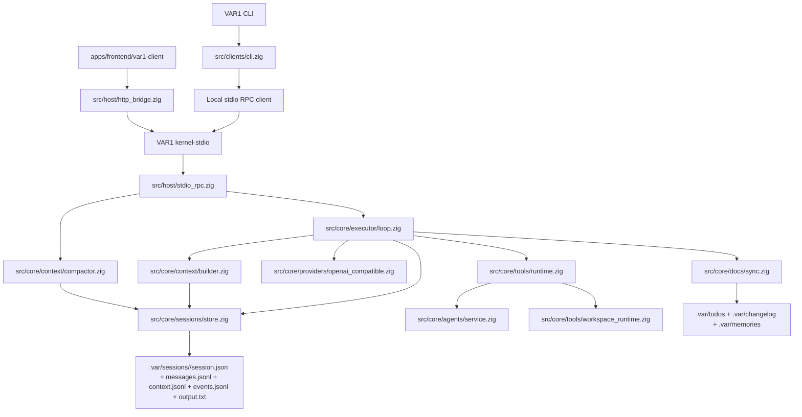
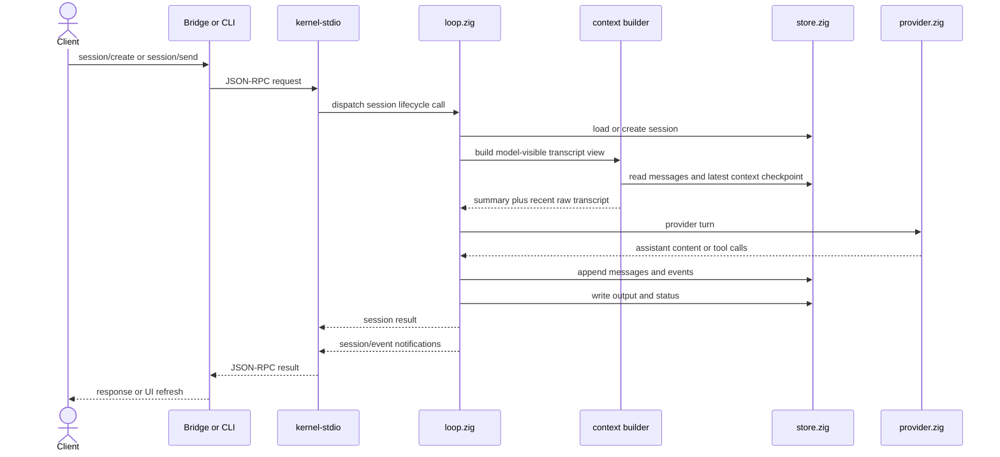
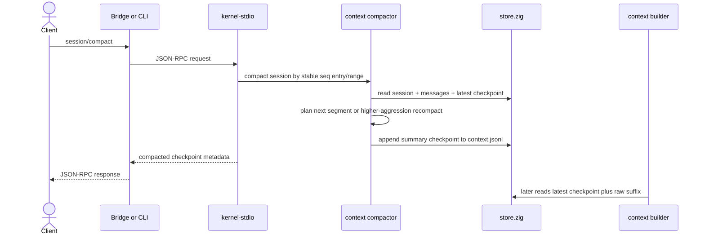
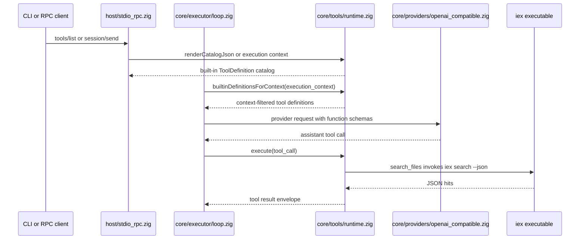
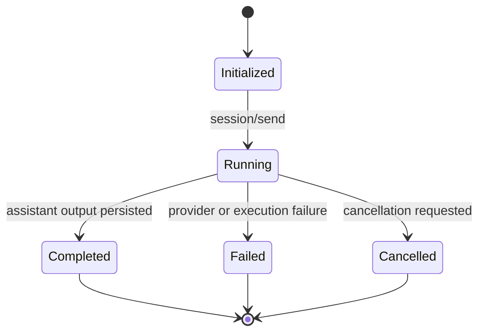

# VAR1 Architecture

This is the canonical architecture map for the current `VAR1` agent harness runtime.

## Architecture lock

- one execution primitive: session
- one durable source of truth: `.var/sessions/<id>/`
- one canonical host protocol: JSON-RPC 2.0 over stdio with Content-Length framing
- one bridge surface for browser clients: `/rpc`, `/events`, `/api/health`
- one executable name: `VAR1`
- one hidden host mode: `kernel-stdio`
- one external browser client: `apps/frontend/var1-client`

## Runtime slice

## Session message flow

## Session compaction flow

## Tool initialization flow

Tool definitions are schema-first. The current repeated shape lives in `shared/types.zig` as `ToolDefinition { name, description, parameters_json, example_json, usage_hint }`. Provider request construction, CLI catalog export, RPC catalog export, and failure repair hints all derive from that single metadata surface.

`search_files` is the content-search tool. It resolves the workspace path in Zig, then invokes `iex search --json --max-hits ...` through the command-runner boundary. `list_files` is the native Zig path-discovery tool and does not shell to `iex`. Installing `VAR1` therefore requires a real `iex` executable for content search; the current binary does not embed or install `iex` by itself.

## Session state machine

## Durable contract

Every session directory contains:

- `session.json`
- `messages.jsonl`
- `context.jsonl`
- `events.jsonl`
- `output.txt`

`messages.jsonl` is the complete append-only transcript. `context.jsonl` is compact checkpoint history written by the context compactor and used by the context builder to create model-visible history without rewriting transcript history. Each checkpoint marks the covered source sequence range, the next raw `first_kept_seq`, `compacted_entry_count`, and `aggressiveness_milli`, so compaction can advance one JSONL entry at a time or recompact an existing range when a stronger slider value is requested.

`store.ensureStoreReady(...)` validates and rewrites existing `.var/sessions/<id>/session.json` records into the current canonical shape. It does not read old roots, old-layout files, or old-layout fields.

## Module ownership

- `src/shared/types.zig`
  shared runtime types and session contracts
- `src/core/sessions/store.zig`
  canonical session storage
- `src/core/executor/loop.zig`
  kernel-owned execution loop
- `src/core/context/builder.zig`
  sole owner for turning session storage into provider-ready transcript messages
- `src/core/context/compactor.zig`
  sole owner for planning and writing manual summary checkpoints from stable message sequence entries/ranges
- `src/core/tools/`
  typed tool socket namespace, built-in tool registry/runtime, command-backed search dispatch, and workspace-state helpers
- `src/core/plugins/`
  plugin manifest/socket contracts only; plugin implementations do not live in core
- `src/shared/protocol/types.zig`
  JSON-RPC methods and payload shapes
- `src/host/stdio_rpc.zig`
  Content-Length framed stdio host and local child-process client
- `src/host/http_bridge.zig`
  HTTP bridge for `/rpc`, `/events`, and `/api/health`
- `src/clients/cli.zig`
  thin protocol-backed CLI
- `apps/frontend/var1-client`
  external static browser client over `/rpc` and `/events`

## Pluggability boundary

`core/` contains kernel capability domains, not plugin names. The current socket hierarchy is intentionally small:

- `core/context/` owns model-visible transcript assembly and manual checkpoint generation.
- `core/tools/` owns tool socket contracts and delegates to the current runtime body.
- `core/plugins/` owns manifest validation for future plugin roots.

Future plugin implementations should live outside `core/` and register through typed sockets. Auto-discovery is not enabled until manifest validation, explicit enablement, deterministic load order, and lifecycle tests are in place.

The next durable tool slice is a per-tool module registry with explicit availability metadata. Command-backed tools such as `search_files` should report the external executable dependency rather than relying on late process-spawn failure as the first availability signal.

## Validation lane

The current validation lane should always prove these slices together:

- `build test`
- `health`
- direct `run`
- delegated child-session `run`
- bridge root response is text, not embedded HTML
- bridge rejects removed facade routes
- external client exists at `apps/frontend/var1-client`

Latest local Windows validation on 2026-04-28:

- `.\scripts\zigw.ps1 build test --summary all` -> `67/67 tests passed`
- `.\scripts\health.ps1` -> `status: ready`
